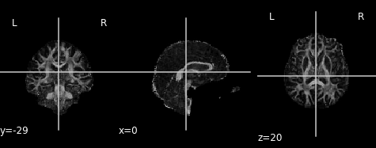
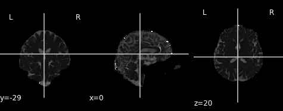
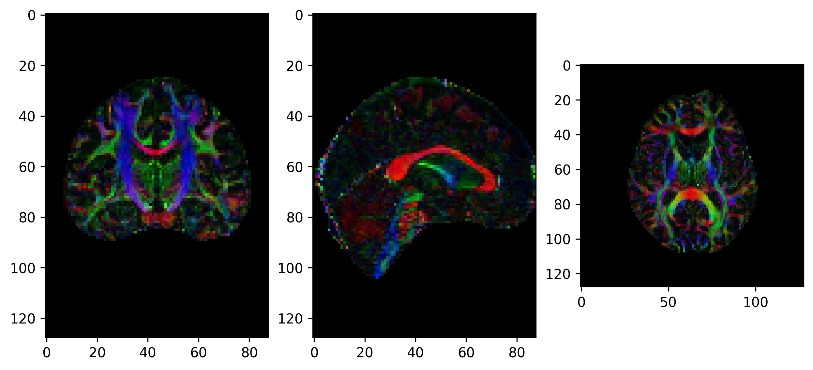
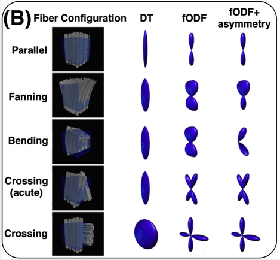
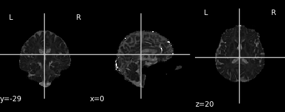
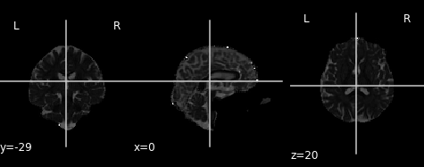

::::::::::::::::::::::::::::::::::::::: objectives

- Understand the tensor model and derived metrics
- Visualizing tensors

::::::::::::::::::::::::::::::::::::::::::::::::::

:::::::::::::::::::::::::::::::::::::::: questions

- What is diffusion tensor imaging?
- What metrics can be derived from DTI?

::::::::::::::::::::::::::::::::::::::::::::::::::

## Diffusion Tensor Imaging (DTI)

Diffusion tensor imaging or "DTI" refers to images describing diffusion with a tensor model.
DTI is derived from preprocessed diffusion weighted imaging (DWI) data. First proposed by Basser
and colleagues ([Basser, 1994](https://www.ncbi.nlm.nih.gov/pubmed/8130344)), the diffusion tensor
model describes diffusion characteristics within an imaging voxel. This model has been very
influential in demonstrating the utility of the diffusion MRI in characterizing the microstructure
of white matter and the biophysical properties (inferred from local diffusion properties).
The DTI model is still a commonly used model to investigate white matter.

The tensor models the diffusion signal mathematically as:

{alt='Diffusion signal equation'}

{alt='Where !\[Diffusion unit vector' class="inline"}
is a unit vector in 3D space indicating the direction of measurement and b are the parameters of
the measurement, such as the strength and duration of diffusion-weighting gradient.
{alt='Diffusion signal' class="inline"}
is the diffusion-weighted signal measured and
{alt='Non-weighted diffusion signal' class="inline"}
is the signal conducted in a measurement with no diffusion weighting.
{alt='Diffusivity' class="inline"}
is a positive-definite quadratic form, which contains six free parameters to be fit.
These six parameters are:

{alt='Diffusivity matrix'}

The diffusion matrix is a variance-covariance matrix of the diffusivity along the three spatial
dimensions. Note that we can assume that the diffusivity has antipodal symmetry, so elements
across the diagonal of the matrix are equal. For example:
{alt='Symmetry in the diffusivity matrix' class="inline"}.
This is why there are only 6 free parameters to estimate here.

Tensors are represented by ellipsoids characterized by calculated eigenvalues
{alt='(!\[Diffusivity matrix eigenvalues' class="inline"}
{alt='and eigenvectors (!\[Diffusivity matrix eigenvectors' class="inline"}
from the previously described matrix.
The computed eigenvalues and eigenvectors are normally sorted in descending magnitude (i.e.
{alt='Diffusivity matrix eigenvalues magnitudes' class="inline"}.
Eigenvalues are always strictly positive in the context of dMRI and are measured in $mm^2/s$.
In the DTI model, the largest eigenvalue gives the principal direction of the diffusion tensor,
and the other two eigenvectors span the orthogonal plane to the former direction.

{alt='Diffusion tensor'}
*Adapted from Jelison et al., 2004*

In the following example, we will walk through how to model a diffusion dataset. While there
are a number of diffusion models, many of which are implemented in `DIPY`.
However, for the purposes of this lesson, we will focus on the tensor model described above.

### Reconstruction with the `dipy.reconst` module

The <code>reconst</code> module contains implementations of the following models:

- Tensor (Basser et al., 1994)
- Constrained Spherical Deconvolution (Tournier et al. 2007)
- Diffusion Kurtosis (Jensen et al. 2005)
- DSI (Wedeen et al. 2008)
- DSI with deconvolution (Canales-Rodriguez et al. 2010)
- Generalized Q Imaging (Yeh et al. 2010)
- MAPMRI (Özarslan et al. 2013)
- SHORE (Özarslan et al. 2008)
- CSA (Aganj et al. 2009)
- Q ball (Descoteaux et al. 2007)
- OPDT (Tristan-Vega et al. 2010)
- Sparse Fascicle Model (Rokem et al. 2015)

The different algorithms implemented in the module all share a similar conceptual structure:

- <code>ReconstModel</code> objects (e.g. <code>TensorModel</code>) carry the parameters that
  are required in order to fit a model. For example, the directions and magnitudes of the gradients
  that were applied in the experiment. <code>TensorModel</code> objects have a <code>fit</code>
  method, which takes  in data, and returns a <code>ReconstFit</code> object. This is where a lot of
  the heavy lifting of the processing will take place.
- <code>ReconstFit</code> objects carry the model that was used to generate the object.
  They also include the parameters that were estimated during fitting of the data. They have
  methods to calculate derived statistics, which can differ from model to model. All objects also
  have an orientation distribution function (<code>odf</code>), and most (but not all) contain
  a <code>predict</code> method, which enables the prediction of another dataset based on the
  current gradient table.

### Reconstruction with the DTI Model

Let's get started! First, we will need to grab the **preprocessed** DWI files
and load them! We will also load in the anatomical image to use as a reference
later on.

```python
import bids
from bids.layout import BIDSLayout
from dipy.io.gradients import read_bvals_bvecs
from dipy.core.gradients import gradient_table
from nilearn import image as img

bids.config.set_option('extension_initial_dot', True)

deriv_layout = BIDSLayout("../data/ds000221/derivatives", validate=False)
subj="010006"

# Grab the transformed t1 file for reference
t1 = deriv_layout.get(subject=subj, space="dwi", extension='nii.gz', return_type='file')[0]

# Recall the preprocessed data is no longer in BIDS - we will directly grab these files
dwi = f"../data/ds000221/derivatives/uncorrected_topup_eddy/sub-{subj}/ses-01/dwi/dwi.nii.gz"
bval = f"../data/ds000221/sub-{subj}/ses-01/dwi/sub-{subj}_ses-01_dwi.bval"
bvec = f"../data/ds000221/derivatives/uncorrected_topup_eddy/sub-{subj}/ses-01/dwi/dwi.eddy_rotated_bvecs"

t1_data = img.load_img(t1)
dwi_data = img.load_img(dwi)

gt_bvals, gt_bvecs = read_bvals_bvecs(bval, bvec)
gtab = gradient_table(gt_bvals, gt_bvecs)
```

Next, we will need to create the tensor model using our gradient table, and then fit the model
using our data! We start by creating a mask from our data. We then apply this mask to avoid
calculating the tensors in the background of the image! This can be done using `DIPY`'s
mask module. Then we will fit out data!

```python
import dipy.reconst.dti as dti
from dipy.segment.mask import median_otsu

dwi_data = dwi_data.get_fdata()
dwi_data, dwi_mask = median_otsu(dwi_data, vol_idx=[0], numpass=1)

dti_model = dti.TensorModel(gtab)
dti_fit = dti_model.fit(dwi_data, mask=dwi_mask)
```

The fit method creates a <code>TensorFit</code> object which contains the fitting parameters and
other attributes of the model. A number of quantitative scalar metrics can be derived from
the eigenvalues! In this tutorial, we will cover fractional anisotropy, mean diffusivity,
axial diffusivity, and radial diffusivity. Each of these scalar, rotationally invariant metrics
were calculated in the previous fitting step!

### Fractional anisotropy (FA)

Fractional anisotropy (FA) characterizes the degree to which the distribution of diffusion in an
imaging voxel is directional. That is, whether there is relatively unrestricted diffusion in
a particular direction.

Mathematically, FA is defined as the normalized variance of the eigenvalues of the tensor:

{alt='FA equation'}

Values of FA vary between 0 and 1 (unitless). In the cases of perfect, isotropic diffusion,
{alt='Isotropic diffusion eigenvalues' class="inline"},
the diffusion tensor is a sphere and FA = 0. If the first two eigenvalues are equal the tensor
will be oblate or planar, whereas if the first eigenvalue is larger than the other two, it will
have the mentioned ellipsoid shape: as diffusion progressively becomes more anisotropic,
eigenvalues become more unequal, causing the tensor to be elongated, with FA approaching 1.
Note that FA should be interpreted carefully. It may be an indication of the density of packing
fibers in a voxel and the amount of myelin wrapped around those axons, but it is not always a
measure of "tissue integrity".

Let's take a look at what the FA map looks like! An FA map is a gray-scale image, where higher
intensities reflect more anisotropic diffuse regions.

We will create the FA image from the scalar data array using the anatomical
reference image data as the reference image:

```python
import matplotlib.pyplot as plt # To enable plotting within notebook
from nilearn import plotting as plot

fa_img = img.new_img_like(ref_niimg=t1_data, data=dti_fit.fa)
plot.plot_anat(fa_img)
```

{alt='FA plot'}

Derived from partial volume effects in imaging voxels due to the presence of different tissues,
noise in the measurements and numerical errors, the DTI model estimation may yield negative
eigenvalues. Such *degenerate* case is not physically meaningful. These values are usually
revealed as black or 0-valued pixels in FA maps.

FA is a central value in dMRI: large FA values imply that the underlying fiber populations
have a very coherent orientation, whereas lower FA values point to voxels containing
multiple fiber crossings. Lowest FA values are indicative of non-white matter tissue in
healthy brains (see, for example, Alexander et al.'s "Diffusion Tensor Imaging of the Brain".
Neurotherapeutics 4, 316-329 (2007), and Jeurissen et al.'s "Investigating the Prevalence of
Complex Fiber Configurations in White Matter Tissue with Diffusion Magnetic Resonance
Imaging". Hum. Brain Mapp. 2012, 34(11) pp. 2747-2766).

### Mean diffusivity (MD)

An often used complimentary measure to FA is mean diffusivity (MD). MD is a measure of the
degree of diffusion, independent of direction. This is sometimes known as the apparent diffusion
coefficient (ADC). Mathematically, MD is computed as the mean eigenvalues of the tensor and
is measured in $mm^2/s$.

{alt='MD equation'}

Similar to the previous FA image, let's take a look at what the MD map looks like. Again, higher
intensities reflect higher mean diffusivity!

```python
md_img = img.new_img_like(ref_niimg=t1_data, data=dti_fit.md)
# Arbitrarily set min and max of color bar
plot.plot_anat(md_img, cut_coords=(0, -29, 20), vmin=0, vmax=0.01)
```

{alt='MD plot'}

### Axial and radial diffusivity (AD \& RD)

The final two metrics we will discuss are axial diffusivity (AD) and radial diffusivity (RD).
Two tensors with different shapes may yield the same FA values, and additional measures such as
AD and RD are required to further characterize the tensor. AD describes the diffusion rate
along the primary axis of diffusion, along
{alt='Axial diffusivity eigenvalue' class="inline"}
, or parallel to the axon (and hence, some works refer to it as the *parallel diffusivity*).
On the other hand, RD reflects the average diffusivity along the other two minor axes
(being named as *perpendicular diffusivity* in some works)
{alt='(!\[Radial diffusivity eigenvalues' class="inline"}
. Both are measured in $mm^2/s$.

{alt='Axial and radial diffusivities'}

### Tensor visualizations

There are several ways of visualizing tensors. One way is using an RGB map, which overlays the
primary diffusion orientation on an FA map. The colours of this map encodes the diffusion
orientation. Note that this map provides no directional information (e.g. whether the diffusion
flows from right-to-left or vice-versa). To do this with `DIPY`, we can use the
<code>color\_fa</code> function. The colours map to the following orientations:

- Red = Left / Right
- Green = Anterior / Posterior
- Blue = Superior / Inferior

:::::::::::::::::::::::::::::::::::::::::  callout

## Diffusion scalar map visualization

The plotting functions in [Nilearn](https://nilearn.github.io/stable/index.html)
are unable to visualize these RGB maps. However, we can use the
[Matplotlib](https://matplotlib.org/) library to view these images.


::::::::::::::::::::::::::::::::::::::::::::::::::

```python
from dipy.reconst.dti import color_fa
RGB_map = color_fa(dti_fit.fa, dti_fit.evecs)

from scipy import ndimage

fig, ax = plt.subplots(1,3, figsize=(10,10))
ax[0].imshow(ndimage.rotate(RGB_map[:, RGB_map.shape[1]//2, :, :], 90, reshape=False))
ax[1].imshow(ndimage.rotate(RGB_map[RGB_map.shape[0]//2, :, :, :], 90, reshape=False))
ax[2].imshow(ndimage.rotate(RGB_map[:, :, RGB_map.shape[2]//2, :], 90, reshape=False))
```

{alt='RGB FA map'}

Another way of visualizing the tensors is to display the diffusion tensor in each imaging voxel
with colour encoding. Below is an example of one such tensor visualization.

{alt='Tensor visualization'}

:::::::::::::::::::::::::::::::::::::::::  callout

## Tensor visualization

Visualizing tensors can be memory intensive. Please refer to the
[DIPY documentation](https://dipy.org/tutorials/) for the necessary steps to
perform this type of visualization.


::::::::::::::::::::::::::::::::::::::::::::::::::

### Some notes on DTI

DTI is only one of many models and is one of the simplest models available for modelling
diffusion. While it is used for many studies, there are also some drawbacks (e.g. ability to
distinguish multiple fibre orientations in an imaging voxel). Examples of this can be seen below!

{alt='DTI drawbacks'}

*Sourced from Sotiropoulos and Zalesky (2017). Building connectomes using diffusion MRI:
why, how, and but. NMR in Biomedicine. 4(32). e3752. doi:10.1002/nbm.3752.*

Though other models are outside the scope of this lesson, we recommend looking into some
of the pros and cons of each model (listed previously) to choose one best suited for your
data!

:::::::::::::::::::::::::::::::::::::::  challenge

## Exercise 1

Plot the axial and radial diffusivity maps of the example given. Start from
fitting the preprocessed diffusion image.

:::::::::::::::  solution

## Solution

```python
from bids.layout import BIDSLayout
from dipy.io.gradients import read_bvals_bvecs
from dipy.core.gradients import gradient_table
import dipy.reconst.dti as dti
from dipy.segment.mask import median_otsu
from nilearn import image as img

deriv_layout = BIDSLayout("../data/ds000221/derivatives", validate=False)
subj="010006"

t1 = deriv_layout.get(subject=subj, space="dwi", extension='nii.gz', return_type='file')[0]
dwi = f"../data/ds000221/derivatives/uncorrected_topup_eddy/sub-{subj}/ses-01/dwi/dwi.nii.gz"
bval = f"../data/ds000221/sub-{subj}/ses-01/dwi/sub-{subj}_ses-01_dwi.bval"
bvec = f"../data/ds000221/derivatives/uncorrected_topup_eddy/sub-{subj}/ses-01/dwi/dwi.eddy_rotated_bvecs"

t1_data = img.load_img(t1)
dwi_data = img.load_img(dwi)

gt_bvals, gt_bvecs = read_bvals_bvecs(bval, bvec)
gtab = gradient_table(gt_bvals, gt_bvecs)

dwi_data = dwi_data.get_fdata()
dwi_data, dwi_mask = median_otsu(dwi_data, vol_idx=[0], numpass=1)

# Fit dti model
dti_model = dti.TensorModel(gtab)
dti_fit = dti_model.fit(dwi_data, mask=dwi_mask) # This step may take a while

# Plot axial diffusivity map
ad_img = img.new_img_like(ref_niimg=t1_data, data=dti_fit.ad)
plot.plot_anat(ad_img, cut_coords=(0, -29, 20), vmin=0, vmax=0.01)

# Plot radial diffusivity map
rd_img = img.new_img_like(ref_niimg=t1_data, data=dti_fit.rd)
plot.plot_anat(rd_img, cut_coords=(0, -29, 20), vmin=0, vmax=0.01)
```

{alt='Axial diffusivity map'}   
Axial diffusivity map.

{alt='Radial diffusivity map'}   
Radial diffusivity map.

:::::::::::::::::::::::::

::::::::::::::::::::::::::::::::::::::::::::::::::


:::::::::::::::::::::::::::::::::::::::: keypoints

- DTI is one of the simplest and most common models used
- Provides information to infer characteristics of axonal fibres

::::::::::::::::::::::::::::::::::::::::::::::::::


